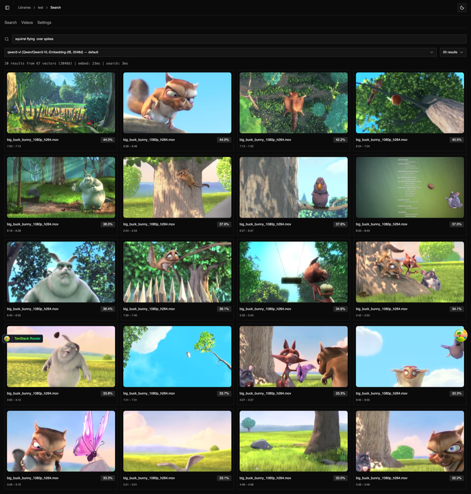

# indecks

A video indexing and semantic search application. Point it at folders of video files, and it chunks, embeds, and indexes them for natural-language search.



## Getting Started

Install dependencies:

```bash
bun install
```

Copy environment files:

```bash
cp apps/server/.env.example apps/server/.env
cp apps/web/.env.example apps/web/.env
```

Edit `apps/server/.env` and set `BETTER_AUTH_SECRET` to a random 32+ character string.

Generate and apply database migrations:

```bash
bun run db:generate
bun run db:migrate
```

## Development

Start the dev server:

```bash
bun run dev
```

- Web: <http://localhost:3001>
- API: <http://localhost:3000>

### Available Scripts

- `bun run dev` - Start all apps in development mode
- `bun run build` - Build all apps
- `bun run dev:web` - Start only the web app
- `bun run dev:server` - Start only the server
- `bun run check` - Run Biome formatting and linting
- `bun run check-types` - Check TypeScript types
- `bun run db:generate` - Generate database migrations
- `bun run db:migrate` - Run database migrations
- `bun run db:studio` - Open Drizzle Studio

## Embedding API

indecks uses an external, OpenAI-compatible embedding API to index video content. Each library can have one or more **indexers**, each pointing at a different provider or model.

An indexer requires:

| Setting | Description |
| --- | --- |
| `baseUrl` | API endpoint (e.g., `http://localhost:8000/v1`) |
| `apiKey` | Bearer token for authentication |
| `model` | Model identifier (e.g., `Qwen/Qwen3-VL-Embedding-2B`) |
| `dimensions` | Expected embedding vector size (e.g., `2048`) |

Any provider that serves an OpenAI-compatible embeddings endpoint works. Tested with [Qwen3-VL-Embedding-2B](https://huggingface.co/Qwen/Qwen3-VL-Embedding-2B) models served via [vLLM](https://docs.vllm.ai).

## Docker

```bash
docker pull ghcr.io/chehanr/indecks:latest
docker run -p 3000:3000 -v indecks-data:/data ghcr.io/chehanr/indecks:latest
```

All data is stored under `/data` in the container. Mount a volume to persist it across restarts.

Override defaults with environment variables:

```bash
docker run -p 3000:3000 \
  -v indecks-data:/data \
  -e BETTER_AUTH_SECRET=your-secret-here \
  -e BETTER_AUTH_URL=http://localhost:3000 \
  -e CORS_ORIGIN=http://localhost:3000 \
  ghcr.io/chehanr/indecks:latest
```

## Data Directory

All runtime data lives under a `data/` directory (gitignored):

```text
data/
  config/       # SQLite database
  vector/       # Vector DB files (sqlite-vec)
  thumbnails/   # Thumbnail cache
```

Paths are configurable via environment variables:

| Variable | Default | Description |
| --- | --- | --- |
| `DATABASE_URL` | `file:./data/config/local.db` | SQLite database URL |
| `VECTOR_DIR` | `./data/vector` | Vector database directory |
| `THUMBNAILS_DIR` | `./data/thumbnails` | Thumbnail cache directory |

## Credits

Inspired by [SentrySearch](https://github.com/ssrajadh/sentrysearch) — wanted something similar but accessible via a web UI. Built over a weekend.
